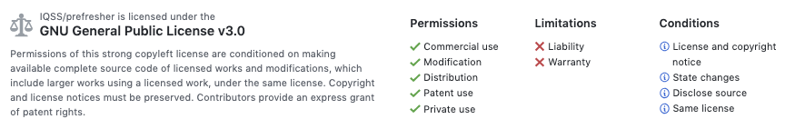

# Replication code for simulations of internal model validation estimate stability
This repo contains R replication code for a STAT-109 project focused on comparing interval validation methods (holdout set, cross-validation, bootstrap) to assess the stability of their performance estimates via simulation.

## License
This material is maintained under a GPL License, and other individuals are welcome to fork, clone, or make copies of the material.

